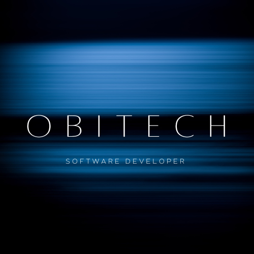

# 💫 About Me:

👋 Hi, I’m @ObiTech , 👀 I’m interested in coding ,🌱 I’m currently a full stack web development  ,💞️ I’m looking to collaborate on to open source and ready to learn more...

## 🌐 Socials:

               

<picture>
  <source media="(prefers-color-scheme: dark)" srcset="https://raw.githubusercontent.com/tobiasmeyhoefer/tobiasmeyhoefer/output/github-snake-dark.svg" />
  <source media="(prefers-color-scheme: light)" srcset="https://raw.githubusercontent.com/tobiasmeyhoefer/tobiasmeyhoefer/output/github-snake.svg" />
  
</picture>

# 💻 🚀 Languages and Tools I Use:

# 📊 GitHub Stats:
 
 

## 🏆 GitHub Trophies

### ✍️ Random Dev Quote

### 🔝 Top Contributed Repo

---

<!-- Proudly created with GPRM ( https://gprm.itsvg.in ) -->